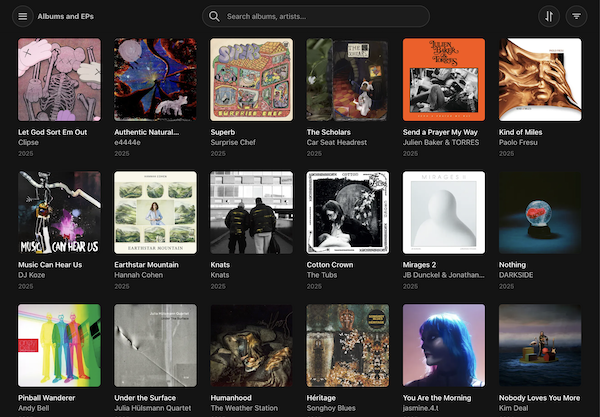
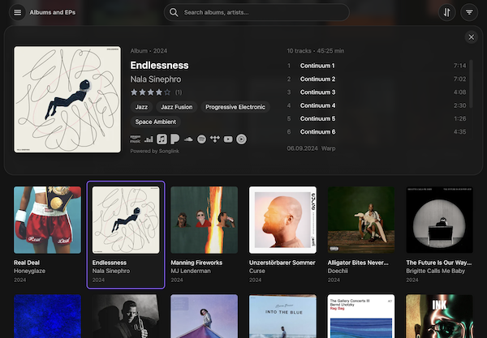
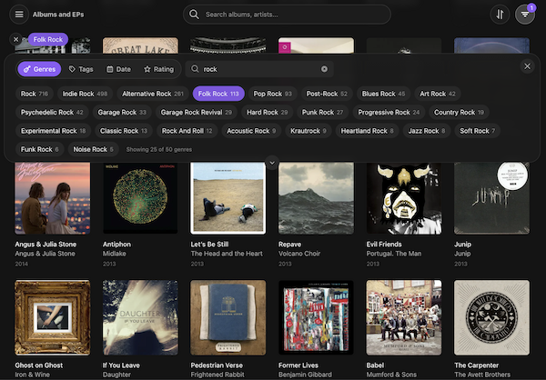

# collection-browser-for-musicbrainz

Next.js-powered collection browser with advanced filtering and streaming integration for MusicBrainz

## Features

- Browse MusicBrainz release-group collections and series (e.g., "Rolling Stone 500")
- Advanced filtering by genres, tags, labels, dates, and ratings with AND/OR logic
- Streaming service links (Spotify, Apple Music, YouTube, and more)
- Optional OAuth for personal collection access
- Modern design with dark theme

## Screenshots

Album Grid:



Album Details:



Album Grid with Filters:



## Requirements

- Node.js 18 or higher
- npm 9 or higher

## Installation

1. Clone the repository:
   ```bash
   git clone https://github.com/tmdecker/collection-browser-for-musicbrainz.git
   cd collection-browser-for-musicbrainz
   ```

2. Install dependencies:
   ```bash
   npm install
   ```

3. Configure environment variables:
   ```bash
   cp .env.example .env.local
   ```

4. Edit `.env.local` with required values:

   ```env
   NEXT_PUBLIC_MUSICBRAINZ_APP_NAME=YourAppName
   NEXT_PUBLIC_MUSICBRAINZ_CONTACT_EMAIL=your.email@example.com
   ```

## Running the Application

**Development:**

```bash
npm run dev
```

Open <http://localhost:3000>

**Production:**

```bash
npm run build
npm start
```

Runs on <http://localhost:3000>

## Using the Application

1. Open the application in your browser
2. Enter a public MusicBrainz collection or series ID/URL directly on the welcome screen
3. Or click "Login with MusicBrainz" to access your personal collections
4. Use the Browse Collections panel (menu button) to switch between collections
5. Apply filters to narrow down albums by genre, label, date, or rating

## Environment Variables

Configure in `.env.local` (see [.env.example](.env.example) for template):

**Required for all usage:**

- `NEXT_PUBLIC_MUSICBRAINZ_APP_NAME` - Your application name
- `NEXT_PUBLIC_MUSICBRAINZ_CONTACT_EMAIL` - Your contact email (MusicBrainz API requirement)

**Optional - to enable user authentication:**

- `MUSICBRAINZ_OAUTH_CLIENT_ID` - OAuth client ID
- `MUSICBRAINZ_OAUTH_CLIENT_SECRET` - OAuth client secret
- `MUSICBRAINZ_OAUTH_REDIRECT_URI` - OAuth callback URL (e.g., `http://localhost:3000/api/auth/callback`)

**What OAuth enables:** One-time setup by app host that allows **all users** to login with their MusicBrainz accounts and access their own collections. Without OAuth configured, users can still browse any public collection by entering its ID directly.

Register at <https://musicbrainz.org/account/applications/register> to get OAuth credentials. See [docs/oauth_setup.md](docs/oauth_setup.md) for detailed setup.

**Optional - for higher streaming link rate limits:**

- `NEXT_PUBLIC_ODESLI_API_KEY` - Odesli API key

## Tech Stack

- Next.js 14
- React 18
- TypeScript
- Tailwind CSS
- IndexedDB for caching
- react-icons (Boxicons)

## Documentation

- [Architecture Overview](docs/architecture.md) - Technical architecture and data flow
- [API Documentation](docs/api.md) - Custom API routes and external integrations
- [Component Guide](docs/components.md) - React component documentation
- [Configuration Guide](docs/configuration.md) - Setup and configuration options
- [IndexedDB Cache System](docs/indexeddb.md) - Caching architecture and troubleshooting
- [OAuth Setup Guide](docs/oauth_setup.md) - MusicBrainz OAuth2 authentication setup
- [Changelog](docs/CHANGELOG.md) - Version history and release notes

## Disclaimer OR Why this app was built

I use MusicBrainz.org as a way to be independent of streaming services when it comes to managing my digital music library. However, unlike those streaming services, MusicBrainz doesn't come with a pretty, modern UI that allows me to browse my library ("collection") in a way I would enjoy. E.g. I would like to view all jazz albums in my collection, or all albums from the 80s. So, this app is tailored to my specific needs and aestetic preferences. Nevertheless, there is lots of room for additional features that are attractive for a larger audience including support of release collections, series or even expansion to the Discogs database.

An honest disclamer on the development process: I have no formal background in software engineering nor web development, and my programming skills are more or less limited to Python, i.e. I don't know much about React apps. This is why I made extensive use of AI coding assistants (Claude Code) in the development of the app, so be aware!

## License

GPL-3.0-or-later  - see [LICENSE](LICENSE) file for details.

## Acknowledgments

Built with [MusicBrainz API](https://musicbrainz.org/doc/MusicBrainz_API) and [Odesli](https://odesli.co/) streaming integration.
